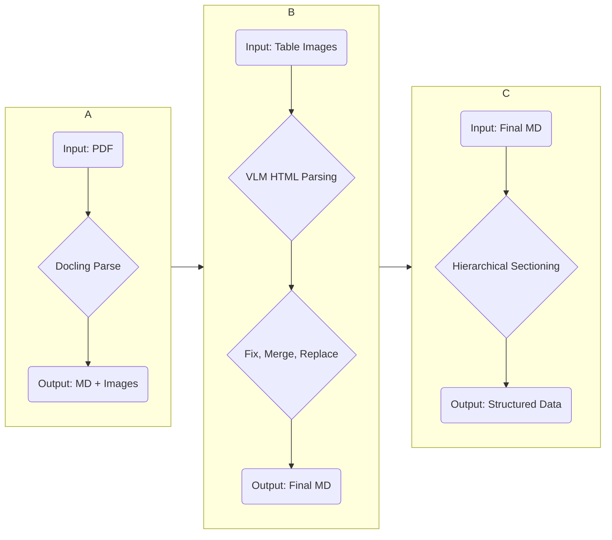

# KIND-Parser

| Parser for KIND Project

## ✨ Features

    📄 Single-Pass PDF Parsing: Leverages docling---{Mu, Layout Model, Tableformer, EasyOCR} to extract all elements—text(to MD.), layout, and images.

    🤖 VLM-Powered Table Recognition: Analyzes high-resolution table images with a VLM to accurately convert tables with complex merged cells into clean HTML.

    🧠 Hierrarchical Structure Generation: Automatically builds a folder structure that mirrors the parent-child relationships defined in the MCP.

    🧩 Modular Pipeline: Decouples the PDF Parsing, VLM Table Processing, and Content Structuring steps, allowing them to be run independently.

    🚀 High-Performance Asynchronous Processing: Utilizes asyncio to efficiently process with concurrent processing.

## ⚙️ Detailed Process Flow

The project executes three core steps, which can be run sequentially or independently to generate the final output.



## 🚀 Quick Start

1. Requirements

    - Python 3.12+

    - docling 2.46.0

    - pymupdf4llm

    - easyocr

    - models [ Layout model, Tableformer (accurate, fast), EasyOCR(ko), VLM(Nanonets-OCRs)]

2. Installation

```Bash

# 1. Clone the repository
git clone <repository_url>
cd kind_parser

# 2. Install dependencies
pip install -r requirements.txt

# 3. Prepare Models
# Place the model artifacts in the directory specified by the --model_path argument.
```

3. Running the Pipeline

To run the entire pipeline sequentially, use the provided shell script.
```Bash

# Execute the full pipeline
bash pdf_parsing.sh
```

## 🔧 Usages

You can run each step independently using the --step argument in main.py. This is extremely useful for debugging or reprocessing a specific stage.

- Step 1: pdf_conversion

    Parses the source PDF files to generate Markdown and high-resolution table images.
    ```Bash

    python main.py --steps pdf_conversion
    ```

- Step 2: vlm_processing

    Processes the table images from Step 1 with a VLM, then replaces and merges the tables in the original Markdown.
    ```Bash

    python main.py --steps vlm_processing
    ```

- Step 3: structuring

    Takes the final Markdown from Step 2 and splits it into "Sections" (Gwan) and "Articles" (Jo) to create the final folder structure.
    ``` Bash

    python main.py --steps structuring
    ```

- Command-Line Arguments

    Key arguments are defined in utils/arg_parser.py and can be dynamically changed at runtime.
    ```Bash

    python main.py \
    --accelerator_thread 128 \
    --model_path "$MODEL_PATH" \
    --data_dir "$DATA_DIR" \
    --output_dir "$OUTPUT_DIR" \
    --file_list_path "$FILE_LIST_PATH" \
    --pdf_parsing_num_workers 10 \
    --image_resolution 4.0 \
    --vlm_base_url "http://50.50.79.151:8000/v1" \
    --vlm_model_name "Nanonets-OCR-s" \
    --vlm_concurrency_limit 300 \
    --steps "pdf_conversion"
    ...
    ```

## 🏗️ Project Structure

```
parser/
├── main.py                 # CLI Entrypoint
├── pdf_parsing.sh          # Pipeline Execution Script
├── core/                   # Core components (Orchestrator, Interfaces)
├── process/                # Independent pipeline steps
├── service-object/         # Business logic services (PDFConverter, VLMProcessor, etc.)
├── models/                 # Data classes and models (FileInfo, DocumentTree)
└── utils/                  # Utility modules (ArgParser, Constants)
```

## 🙏 Acknowledgements

This project would not have been possible without the powerful document analysis capabilities of the docling library.

## 📝 TODO

    [ ✅ ] Parallel Processing (Auto-calculate process num)

    [ ✅ ] Constants to paths and parameters.

    [ 🟢 ] Unit and integration tests for each service and step.

    [ 🔴 ] Table postprocess Algorithm.
